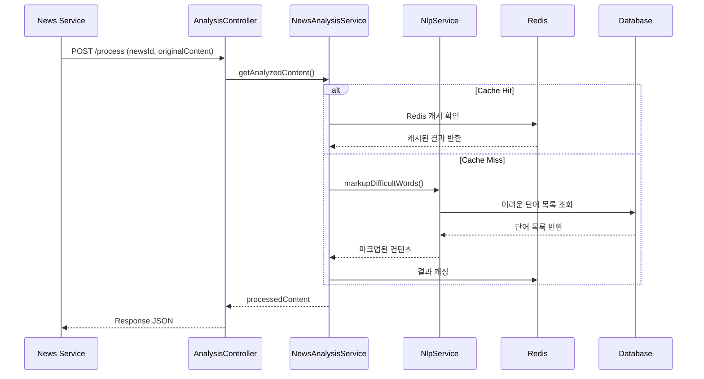
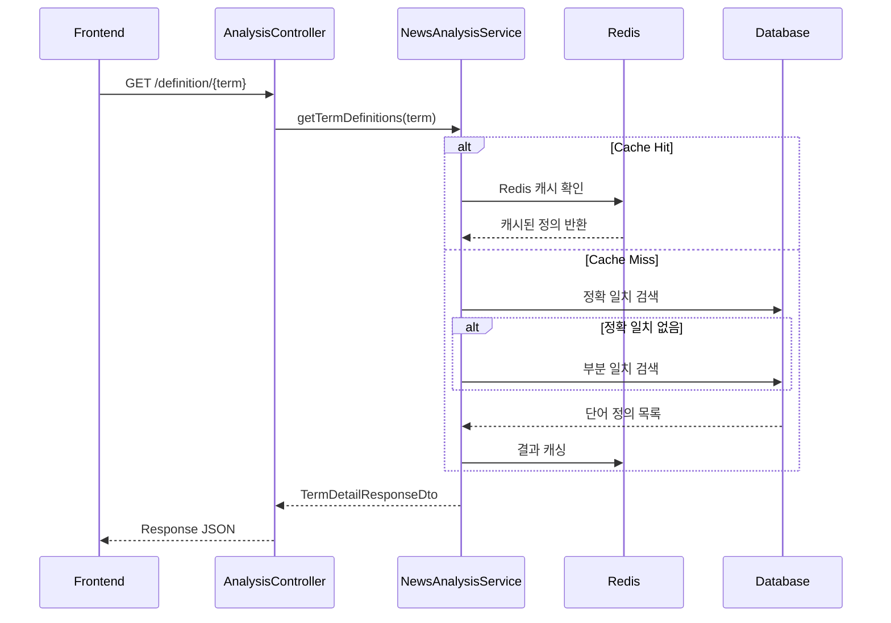

# Tooltip Service API 인터페이스 설계서

## 📖 개요

**서비스명**: Tooltip Service  
**담당 컨트롤러**: AnalysisController  
**기본 URL**: `http://localhost:8086/api/news/analysis`  
**목적**: 뉴스 본문 분석 및 어려운 단어 정의 제공

---

## 🔗 API 엔드포인트 목록

### 1. 뉴스 본문 분석 및 마크업 API

### 2. 단어 정의 조회 API

---

## 📋 API 상세 스펙

### 1️⃣ **뉴스 본문 분석 및 마크업**

#### **기본 정보**

- **URL**: `POST /api/news/analysis/process`
- **설명**: 뉴스 본문을 NLP 분석하여 어려운 단어에 `<span>` 태그 마크업 적용
- **인증**: 불필요 (내부 서비스 간 통신)

#### **요청 (Request)**

**Headers**

```http
Content-Type: application/json
```

**Body**

```json
{
  "newsId": 12345,
  "originalContent": "정부가 내년 예산(豫算)을 편성하며 경제 활성화를 위한 정책을 발표했다."
}
```

**요청 필드 설명**

| 필드명            | 타입     | 필수 | 설명                          | 예시                      |
| ----------------- | -------- | ---- | ----------------------------- | ------------------------- |
| `newsId`          | `Long`   | ✅   | 뉴스 고유 ID (캐싱 키로 사용) | `12345`                   |
| `originalContent` | `String` | ✅   | 분석할 원본 뉴스 본문         | `"정부가 내년 예산을..."` |

#### **응답 (Response)**

**성공 응답 (200 OK)**

```json
{
  "processedContent": "정부가 내년 <span class=\"tooltip-word\" data-term=\"예산\">예산</span>(豫算)을 편성하며 경제 활성화를 위한 정책을 발표했다."
}
```

**응답 필드 설명**

| 필드명             | 타입     | 설명                        | 예시                             |
| ------------------ | -------- | --------------------------- | -------------------------------- |
| `processedContent` | `String` | 마크업이 적용된 HTML 텍스트 | `"정부가 내년 <span class=...>"` |

**오류 응답**

- **500 Internal Server Error**: 분석 실패 시 원본 내용 반환

---

### 2️⃣ **단어 정의 조회**

#### **기본 정보**

- **URL**: `GET /api/news/analysis/definition/{term}`
- **설명**: 특정 단어의 모든 정의를 displayOrder 순으로 조회
- **인증**: 불필요 (공개 API)

#### **요청 (Request)**

**Path Parameter**

| 필드명 | 타입     | 필수 | 설명        | 예시   |
| ------ | -------- | ---- | ----------- | ------ |
| `term` | `String` | ✅   | 조회할 단어 | `예산` |

**URL 예시**

```
GET /api/news/analysis/definition/예산
GET /api/news/analysis/definition/%EC%98%88%EC%82%B0  (URL 인코딩)
```

#### **응답 (Response)**

**성공 응답 (200 OK)**

```json
{
  "term": "예산 (豫算)",
  "definitions": [
    {
      "definition": "필요한 비용을 미리 계산해 둠. 또는 그 돈.",
      "displayOrder": 1
    },
    {
      "definition": "진작부터 마음에 두어 작정을 함. 또는 그 작정.",
      "displayOrder": 2
    }
  ]
}
```

**응답 필드 설명**

| 필드명                       | 타입      | 설명                              | 예시                 |
| ---------------------------- | --------- | --------------------------------- | -------------------- |
| `term`                       | `String`  | DB에 저장된 대표 용어 (한자 포함) | `"예산 (豫算)"`      |
| `definitions`                | `Array`   | 정의 목록 (displayOrder 순)       | `[{...}, {...}]`     |
| `definitions[].definition`   | `String`  | 단어의 정의 설명                  | `"필요한 비용을..."` |
| `definitions[].displayOrder` | `Integer` | 정의 표시 순서                    | `1, 2, 3...`         |

**오류 응답**

- **404 Not Found**: 단어를 찾을 수 없음

---

## 🔄 처리 플로우

### **뉴스 본문 분석 플로우**



### **단어 정의 조회 플로우**



---

## ⚙️ 기술적 특징

### **캐싱 전략**

- **뉴스 분석**: `processedContent` (키: newsId, TTL: 24시간)
- **단어 정의**: `termDetails` (키: term.toLowerCase(), TTL: 24시간)

### **검색 전략**

1. **정확 일치** 우선 검색
2. **부분 일치** 백업 검색 (LIKE 'term%')
3. **길이 순 정렬** (짧은 단어 우선)

### **오류 처리**

- **분석 실패 시**: 원본 내용 반환 (사용자 경험 우선)
- **단어 없음**: 404 반환 (명확한 오류 시그널)

### **성능 최적화**

- **Redis 캐싱**: 반복 요청 성능 향상
- **비동기 처리 고려**: 대용량 텍스트 분석 시
- **메모리 캐시**: 어려운 단어 목록 애플리케이션 레벨 캐싱

---

## 📊 데이터 모델

### **VocabularyTerm (어려운 단어)**

```sql
CREATE TABLE vocabulary_term (
    vocabulary_term_id BIGINT PRIMARY KEY,
    term VARCHAR(255) NOT NULL  -- 예: "예산 (豫算)"
);
```

### **TermDefinition (단어 정의)**

```sql
CREATE TABLE term_definition (
    term_definition_id BIGINT PRIMARY KEY,
    vocabulary_term_id BIGINT,
    definition TEXT NOT NULL,
    display_order INTEGER,
    FOREIGN KEY (vocabulary_term_id) REFERENCES vocabulary_term(vocabulary_term_id)
);
```

---

## 🔒 보안 고려사항

### **입력 검증**

- **newsId**: Long 타입 검증
- **originalContent**: XSS 방지 (출력 시 이스케이프)
- **term**: SQL Injection 방지 (JPA 사용)

### **출력 보안**

- **HTML 마크업**: 신뢰할 수 있는 태그만 허용
- **정의 내용**: 특수문자 이스케이프

### **서비스 간 통신**

- **내부 API**: 네트워크 레벨 보안 (방화벽)
- **공개 API**: Rate Limiting 고려

---

## 📈 모니터링 지표

### **성능 지표**

- **응답 시간**: P95 < 500ms
- **캐시 히트율**: > 80%
- **처리량**: 분당 1000건 이상

### **오류 지표**

- **5xx 오류율**: < 1%
- **404 오류율**: < 5% (정상적인 단어 없음)

### **비즈니스 지표**

- **마크업 단어 수**: 문서당 평균 개수
- **인기 단어**: 조회 빈도 TOP 10

---

_문서 버전: v1.0_  
_최종 수정일: 2025-08-29_  
_작성자: AI Assistant_
